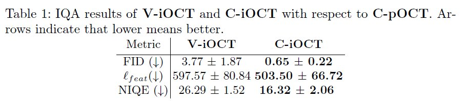
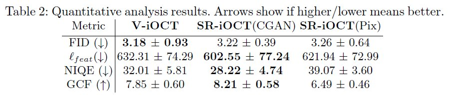
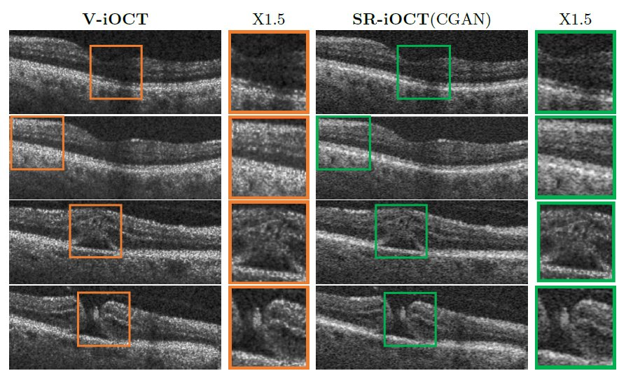

# Intra-operative OCT (iOCT) Image Quality Enhancement: A Super-Resolution Approach using High Quality iOCT 3D Scans

**Presented at Ophthalmic Medical Image Analysis (OMIA) 2021, MICCAI WORKSHOP**:  [Intra-operative OCT (iOCT) Image Quality Enhancement](https://link.springer.com/chapter/10.1007/978-3-030-87000-3_3)

## Introduction 

This reposirtory contains the implementation of the methods presented in the paper "Intra-operative OCT (iOCT) Image Quality Enhancement: A Super-Resolution Approach using High Quality iOCT 3D Scans", presented at OMIA 2021.

## Abstract

Effective treatment of degenerative retinal diseases will require robot-assisted intraretinal therapy delivery supported by excellent
retinal layer visualisation capabilities. Intra-operative Optical Coherence
Tomography (iOCT) is an imaging modality which provides real-time,
cross-sectional retinal images partially allowing visualisation of the layers where the sight restoring treatments should be delivered. Unfortunately, iOCT systems sacrifice image quality for high frame rates, making
the identification of pertinent layers challenging. This paper proposes a
Super-Resolution pipeline to enhance the quality of iOCT images leveraging information from iOCT 3D cube scans.We first explore whether 3D
iOCT cube scans can indeed be used as high-resolution (HR) images by
performing Image Quality Assessment. Then, we apply non-rigid image
registration to generate partially aligned pairs, and we carry out data
augmentation to increase the available training data. Finally, we use
CycleGAN to transfer the quality between LR and HR domain. Quantitative analysis demonstrates that iOCT quality increases with statistical
significance, but a qualitative study with expert clinicians is inconclusive
with regards to their preferences.

## Methods

### Dataset
We used an internal dataset of intra-operative retinal surgery videos and OCT/iOCT scans from 66 patients acquired at Moorfields Eye Hospital, London, UK. 
We ended up having 983 images per type (**V-iOCT**, **C-iOCT**, **C-pOCT**). 


### Image Quality Assessment (IQA)
IQA metrics implementation files can be found in ``` metrics ```. Run the L_feat, FID, NIQE and GCF.

### Registration
Registration implementation files can be found in ``` registration ```. 


### Data Augmentation

### Super Resolution using CycleGAN and Pix2Pix

For CycleGAN model we used the  [[Tensorflow]](https://github.com/XHUJOY/CycleGAN-tensorflow) implementation by Xiaowei Hu.

For Pix2Pix we used the [[Tensorflow]](https://github.com/affinelayer/pix2pix-tensorflow) implementation by Christopher Hesse.


## Results

### IQA

Table 1 summarises IQA results. The values of the three metrics (FID, l_feat, NIQE) are lower
for C-iOCT which indicates better perceptual quality with respect to C-pOCT and thus they can be
used as HR images. 



### Quantitative Results
The analysis was based on the: V-iOCT (LR), SR-iOCT(CGAN) (SR using CycleGAN), SR-iOCT(Pix) (SR using Pix2Pix) and C-iOCT (HR) test sets.  FID, l_feat, NIQE  and the no-reference Global Contrast Factor (GCF)  metrics were used.



### Qualitative Results




## Citation

If you use this code for your research, please cite our paper:

 ``` 
  @inproceedings{komninos2021intra,
  title={Intra-operative OCT (iOCT) Image Quality Enhancement: A Super-Resolution Approach Using High Quality iOCT 3D Scans},
  author={Komninos, Charalampos and Pissas, Theodoros and Flores, Blanca and Bloch, Edward and Vercauteren, Tom and Ourselin, S{\'e}bastien and Da Cruz, Lyndon and Bergeles, Christos},
  booktitle={8th International Workshop on Ophthalmic Medical Image Analysis, OMIA 2021 held in conjunction with 24th International Conference on Medical Image Computing and Computer Assisted Intervention, MICCAI 2021},
  pages={21--31},
  year={2021},
  organization={Springer Science and Business Media Deutschland GmbH}
}
  ```


